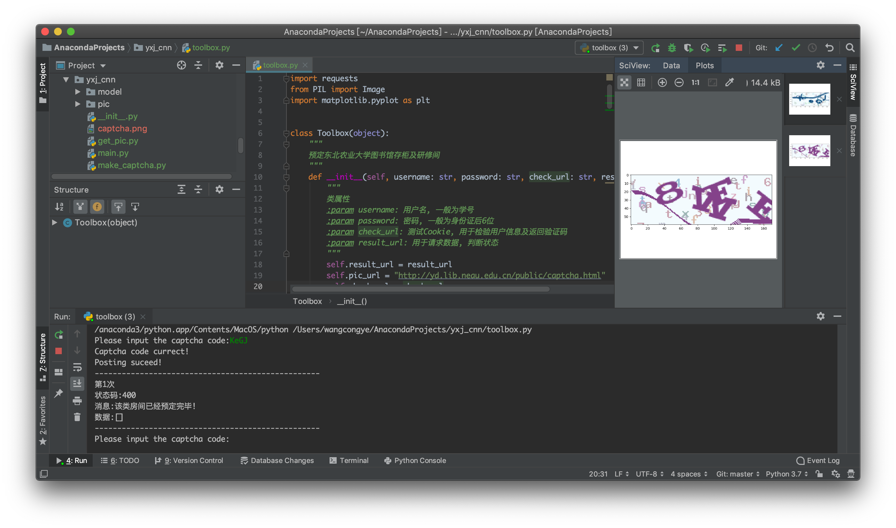

# NEAU-Library-Booking
适用于东北农业大学图书馆存柜及研修间预定

## 环境
1. `Python3.7`
2. `PILLOW`
3. `Matplotlib`

### 安装
`pip install Pillow `

`pip install matplotlib`

## 效果

## 已解决
1. 若所用IDE为**Pycharm**, 则返回验证码将显示在右上方

## 待解决
1. 打包为可执行文件
2. 增加GUI界面